# Subnetting Fundamentals

## What is Subnetting?

### Networking Basics

#### Simple Example
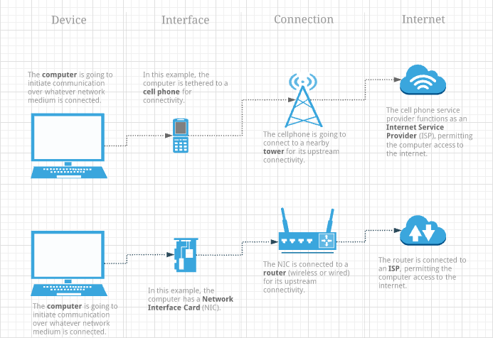

#### Larger Example
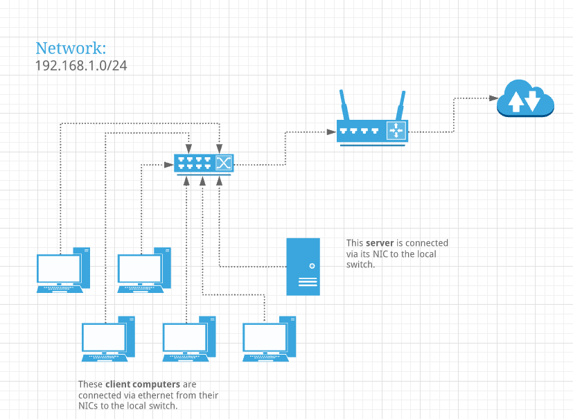

#### Components
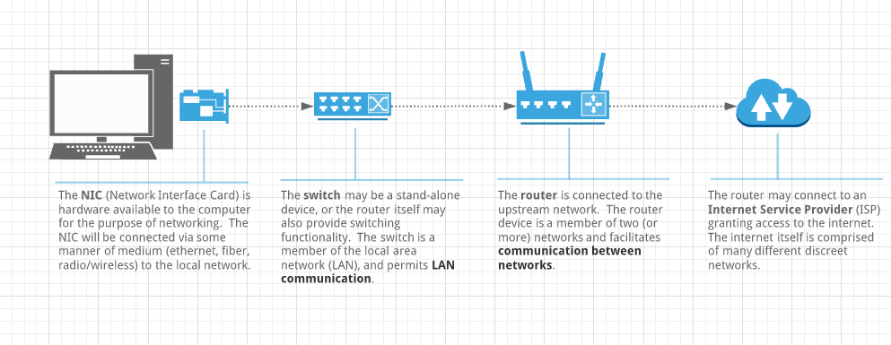

### Networking Traffic

#### Unicast Traffic Method
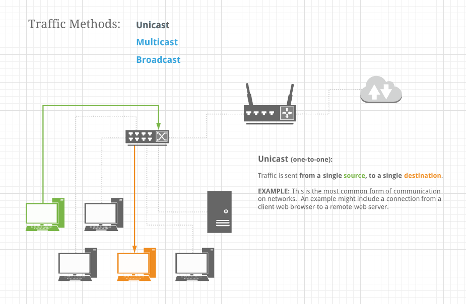

#### Multicast Traffic Method
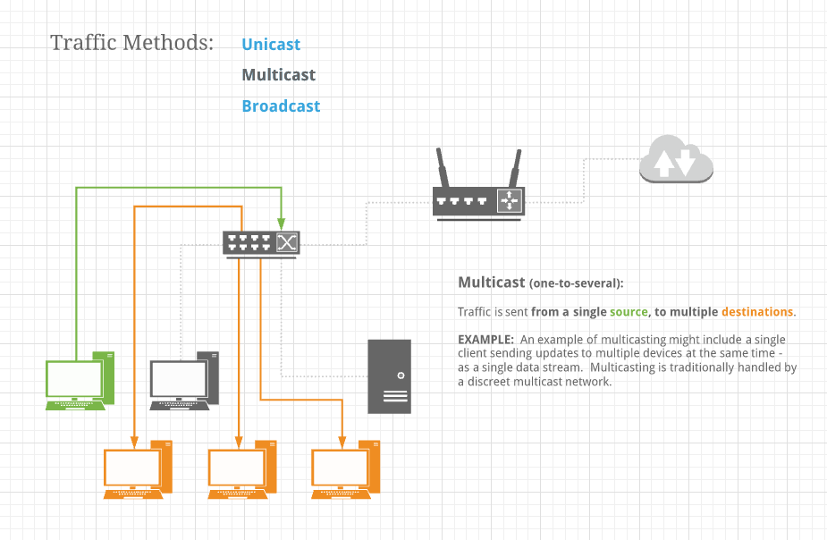

#### Broadcast Traffic Method
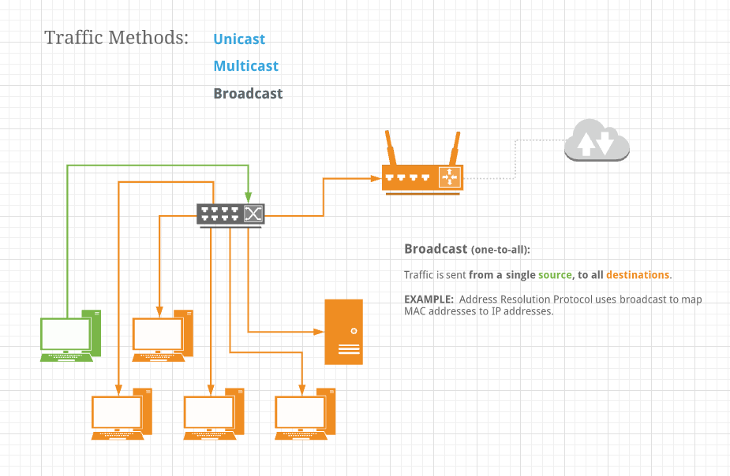

#### OSI Model
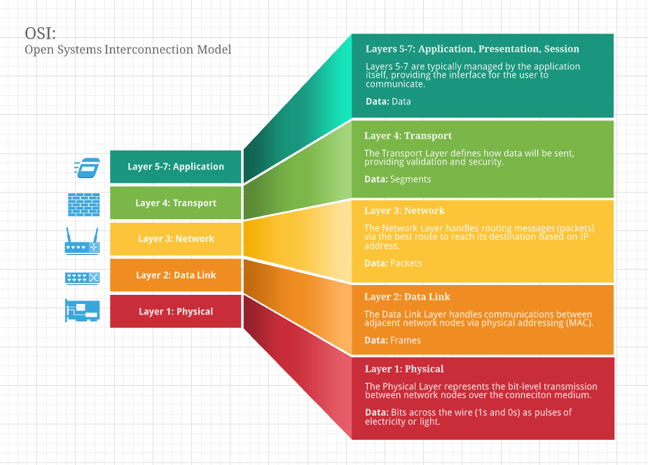

#### OSI Data Examples
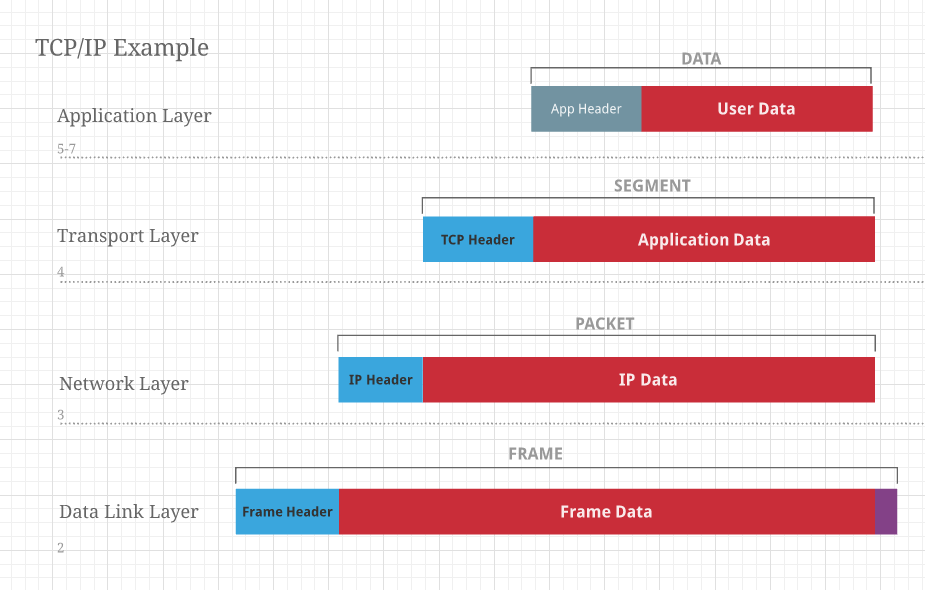

#### TCP Header
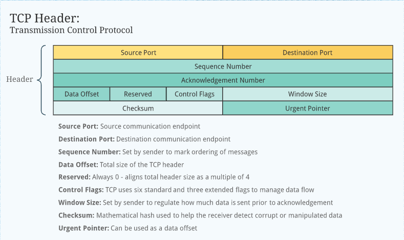

#### IP Header
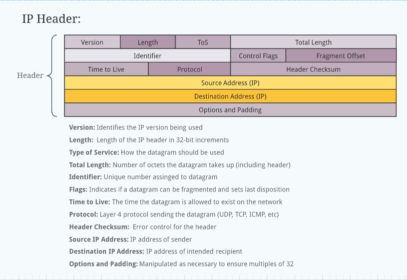

#### Frame Header
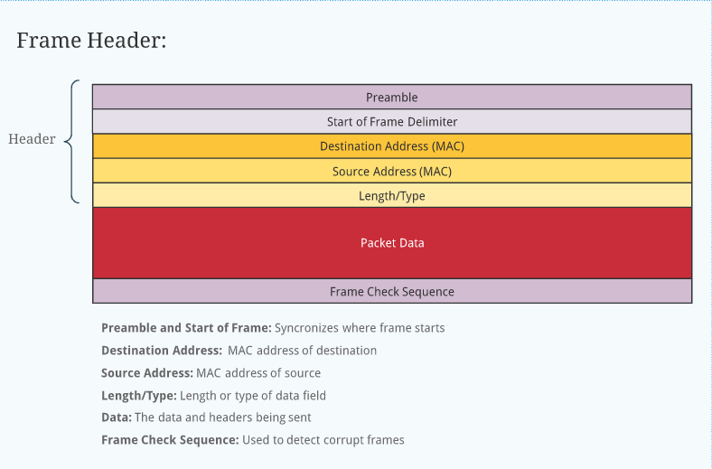

### Networking Segmentation

### Addressing

### Binary

### Binary IPs

## Subnetting Strategies

### Network Masks

### Subnetting Calculation

### Classful Networking

### All-Ones and Subnet Zero

### CIDR

### FLSM and VLSM
