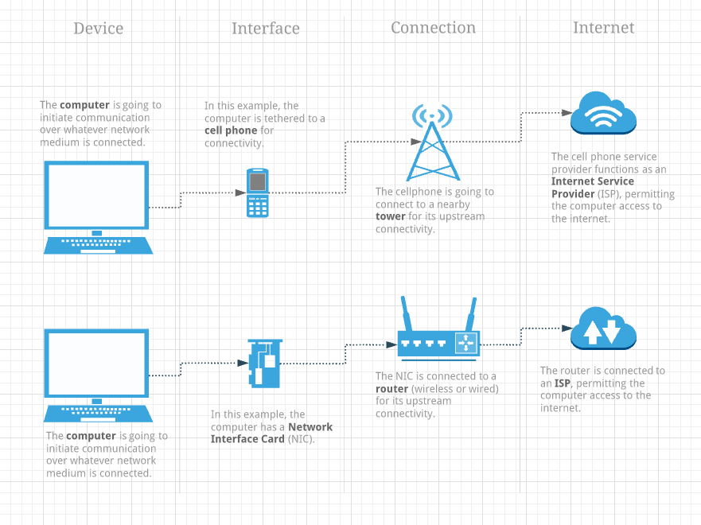
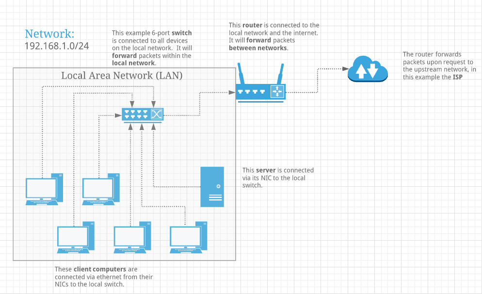

# Subnetting Fundamentals

## What is Subnetting?

### Networking Basics

### Networking Traffic

### Networking Segmentation

### Addressing

### Binary

### Binary IPs

## Subnetting Strategies

### Network Masks

### Subnetting Calculation

### Classful Networking

### All-Ones and Subnet Zero

### CIDR

### FLSM and VLSM
